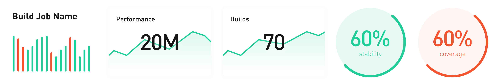
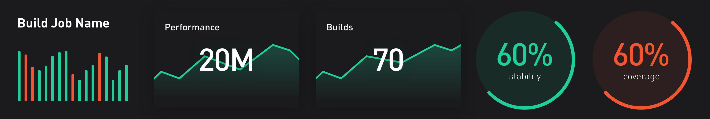

# Why create a metrics platform?

## Problem

Software teams lack insight into [project metrics](05_project_metrics.md) like build performance, build stability, and codebase quality. There's not a language agnostic build and test analytics platform to visualize data in an actionable way.

# What is the scope of the project?

## Solution

Create a dashboard to track build performance, build count, build stability, and code coverage. Eventually expand to include detailed performance data, build analytics, and test analytics.

This is similar to Gradle Enterprise except the goal is to support any build system and any languge. Gradle Enterprise also lacks a dashboard feature.

## Minimal Viable Product

The design should support different color themes.

See [metrics dashboard](06_metrics_dashboard.md) for details.

Overall status

- [x] Wireframes
- [x] UI Design
- [ ] Database setup
- [ ] UI development
- [ ] Unit & UI test development

# How will the project be developed?

## Tech Stack

- [GitHub](https://github.com/software-platform/metrics) is used to store the source code
- [ZenHub](https://www.zenhub.com/) is the project management software (install the [free extension](https://www.zenhub.com/extension))
- [Flutter Web](https://flutter.dev/web) is the framework
- [Adobe XD](https://www.adobe.com/products/xd.html) is the design tool because of [upcoming Flutter support](https://theblog.adobe.com/xd-flutter-plugin-generate-dart-code-design-elements/)

## Architecture

- CLEAN architecture (from resocoder) with States Rebuilder
  - [Flutter TDD Clean Architecture](https://resocoder.com/2019/08/27/flutter-tdd-clean-architecture-course-1-explanation-project-structure/)

- States Rebuilder for state management
  - [GIfatahTH/states_rebuilder example](https://github.com/GIfatahTH/states_rebuilder/tree/master/example)
  - [State Management with states rebuilder part 1](https://medium.com/flutter-community/state-management-gymnastics-using-states-rebuilder-part-1-3ba3a6abf9c7)
  - [State Management with states rebuilder part 2](https://medium.com/flutter-community/state-management-gymnastics-using-states-rebuilder-part-2-a7fa0dd7dc51)
  - [States Rebuilder Clean Architecture Example](https://github.com/GIfatahTH/states-rebuilder-examples/tree/master/007-clean_architecture_dane_mackier_app)

## Principles: Simplify. Standardize. Automate.

Features should be developed in a simple and standardized way. Automation should be used to ensure application stability and developer velocity.

