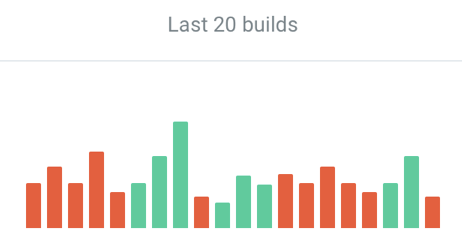

# Project metrics definitions

## Build Result
A Build Result metric is the result of the latest build. It can be successful, failed, or unknown.
The information about the build result comes from the CI system with the other information about builds. 
* A successful build result indicates the success of all necessary checks, such as tests, code style analysis, builds, 
and others. A successful build result is displayed as a checkmark on a green background.   
* A failed build result indicates a failure of some necessary checks. A failed build result is displayed as a cross on a red background. 
* An unknown build status indicates an absence of builds to display a build result. An unknown build result is displayed as a dash on a gray background. 
    
Build Results (Dark theme) - Positive, Negative, Unknown.
    
Build Results (Light theme) - Positive, Negative, Unknown.

## Performance
A Performance metric is an average build duration of successful builds excluding the queue time. The information about each build duration comes from the CI and includes the duration of all performed checks. It is displayed as a label, with a performance sparkline graph below it.
A performance sparkline graph displays an average daily performance grouped by the last 7 days including the current day.        
    
Performance Sparkline Graph (Dark theme).
   
Performance Sparkline Graph (Light theme).

## Builds
Builds metric is a count of builds per week per project. The information about the number of builds comes from the CI.
It includes the builds number per last 7 days including the current day.    
    
Builds Number (Dark theme).      
   
Builds Number (Light theme).    
                    
## Stability
A Stability metric is a ratio of successful builds to total builds per week, measured in percent. The information about the stability comes from the CI system.
It includes the stability of the last 7 days including the current day.
For example, if 6 out of 10 builds are successful metric value is 60%. 
Depending on its value, stability appears differently:
* If the stability is >= 80%, it is considered positive and green colors are used.
* If the stability is < 80% and >= 51%, it is considered neutral and yellow colors are used.
* If the stability is < 51%, it is considered negative and red colors are used.
* If the stability is not specified, it is considered inactive and the stability is displayed as a dash mark on a grey background.
    
Stability (Dark theme) - Positive, Neutral, Negative, Inactive.
   
Stability (Light theme) - Positive, Neutral, Negative, Inactive. 

## Coverage
Coverage metric is a ratio of lines of code executed while running tests to total lines of code, measured in percent.
The information about the coverage comes from the coverage artifact that is created by the CI system.
Depending on its value, coverage appears differently:
* If the coverage is >= 80%, it is considered as positive and green colors are used.
* If the coverage is < 80% and >= 51%, it is considered as neutral and yellow colors are used.
* If the coverage is < 51%, it is considered as negative and red colors are used.
* If the coverage is not specified, it is considered as inactive and the stability is displayed as a dash mark on a grey background.
    
Coverage (Dark theme) - Positive, Neutral, Negative, Inactive. 
   
Coverage (Light theme) - Positive, Neutral, Negative, Inactive. 

**branch coverage** is the selected metric for code coverage. Web projects report a summary JSON `coverage/coverage-summary.json` from [istanbul](https://istanbul.js.org/docs/advanced/alternative-reporters/#json-summary)