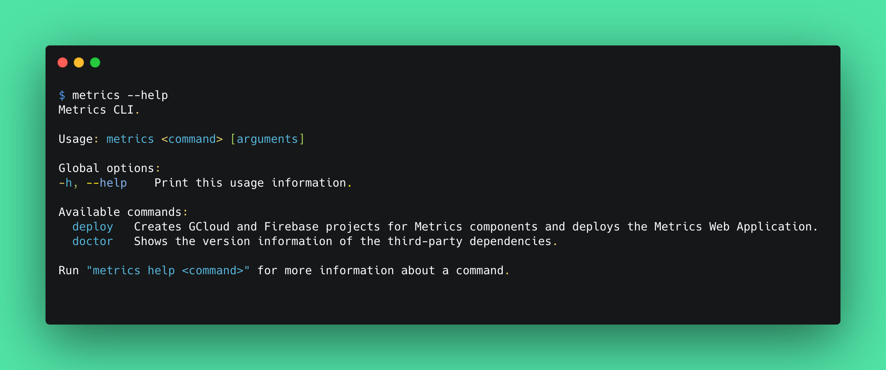

# Metrics CLI

A simple command-line application that simplifies the deployment of Metrics components (Flutter Web application, Cloud Functions, Firestore Rules) and general setup.



Metrics CLI is available to install on macOS and Linux.

# Requirements

The `Metrics CLI` is based on a list of third-party packages. To view the recommended versions of the dependencies, please check out the [dependencies file](https://github.com/platform-platform/dashboard/tree/update_metrics_cli_readme/metrics/cli/recommended_versions.yaml).

# Installation

The `Metrics CLI` is available via source code and as a downloadable binary from the releases page. 

## Build from the source

If you've downloaded the [Metrics CLI](https://github.com/platform-platform/dashboard/tree/master/metrics/cli) via `git clone`, use the following command from inside the `cli` folder to build from the source:

```bash
make build
```

Now you can execute `Metrics CLI` commands using the next form:

```bash
./build/metrics <command>
``` 

## Use the releases

You can download the built Metrics CLI tool from the [CLI releases](https://github.com/platform-platform/monorepo/releases/tag/metrics-cli-snapshot) page. Select a release depending on your operating system (at the moment, it can be either `Linux` or `macOS`) and download a binary file. You can also use the following links:
- [`CLI for Linux`](https://github.com/platform-platform/monorepo/releases/download/metrics-cli-snapshot/metrics_cli_linux)
- [`CLI for macOS`](https://github.com/platform-platform/monorepo/releases/download/metrics-cli-snapshot/metrics_cli_macos)

Now you can use the binary to run `Metrics CLI` commands:

```bash
metrics <command>
```

# Usage

The Metrics CLI command has the following structure:

```bash
metrics <command> [arguments]
```

## Available commands

The next table lists commands with their descriptions:

| Command | Description |
| --- | --- |
| `doctor`   | Shows the version information of the third-party dependencies. |
| `deploy`   | Creates GCloud and Firebase projects for Metrics components and deploys the Metrics Web Application. |

To get more information about the particular command run the following:

```bash
metrics help <command>
```

# License

Created from templates made available by Stagehand under a BSD-style
[license](https://github.com/dart-lang/stagehand/blob/master/LICENSE).
