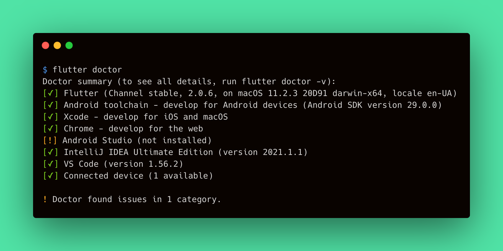
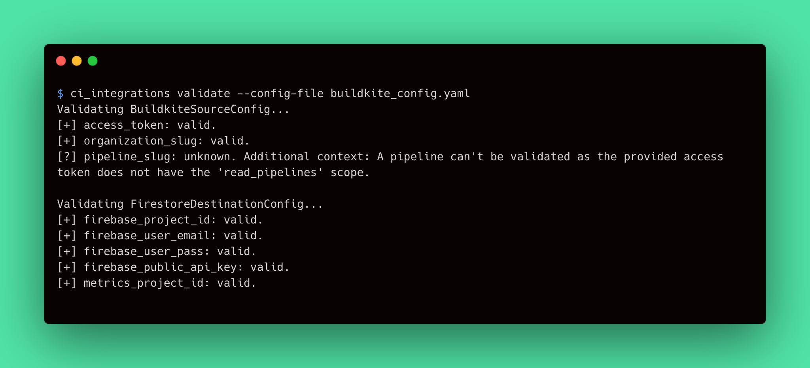

# Doctor Command Output Improvements

The Metrics CLI `doctor` command checks all third-party CLI tools that participates in a deployment process. As the command is to be generally used by end-users, we should improve the output of the `doctor` command to make it more comfortable.

## Contents

In this section, provide the contents for the document including all custom subsections created.

- [**Analysis**](#analysis)
    - [Feasibility study](#feasibility-study)
    - [Requirements](#requirements)
    - [Landscape](#landscape)
    - [Prototyping](#prototyping)
    - [System modeling](#system-modeling)
- [**Design**](#design)
    - [Architecture](#architecture)
    - [User Interface](#user-interface)
    - [Database](#database)
    - [Program](#program)

## Analysis

The following analysis discovers the Metrics CLI `doctor` command output improvements feature. This feature purposes to improve the output of the `doctor` command in a way it would be clearer for users.

The analysis defines the requirements for the feature, studies its feasibility, and selects the implementation approach.

### Feasibility Study
> A preliminary study of the feasibility of implementing this feature.

The `doctor` command should provide clear and readable results, so the user can study them and perform additional configurations on their machine if necessary. Hence, the `doctor` command output is critical for a successful deployment of the Metrics applications. We should ensure that users won't be confused, by providing a convenient, fancy, and clear way to check the machine readiness for Metrics deployment. 

According to the above, we can conclude that the feature makes sense and the Metrics CLI `doctor` command output is to be improved. If a user decided to use Metrics CLI for deployment, it is critical to provide this user with a validation command having human-friendly output.

To admit that this is possible to implement the feature, let's take a look at the existing examples:

- Flutter provides the similar `doctor` command that validates the environment to be ready for development using Flutter SDK. The command output is clear and useful, and provides the conclusion of the command run summarizing results.
     
     

- The Ci Integrations `validate` command consumes the configuration file and validates its fields resulting in a clear output with conclusions for each field.

     

Therefore, the feature implementation is possible since the real-case examples exist.

### Requirements
> Define requirements and make sure that they are complete.

The `doctor` command performs the set of checks that validates whether the machine has the required third-party tools installed. Each check stand for a single validation item for the environment the Metrics CLI run in. The `doctor` command output consists of a set of results for each validation item performed during the command run. Therefore, we can state that the command run itself is a validation process for the environment. This makes the `doctor` command similar to the CI Integrations `validate` command for [Config Validator](https://github.com/platform-platform/monorepo/blob/master/metrics/ci_integrations/docs/04_ci_integrations_config_validator.md). Let's define the requirements for the output improvements feature:

- A single check shouldn't output to the user's console to avoid confusion.
- A single check shouldn't output errors to the user's console to avoid confusion.
- A single check output should start with a leading box with an indicator that clearly defines the result of the validation.
     - The successful validation should start with the mark sign in a brackets: `[✓]`.
     - The failed validation should start with the cross sign in a brackets: `[✗]`.
     - The validation that finishes successfully but has warnings should start with the exclamation sign in a brackets: `[!]`.
     - The validation with unknown result should start with the question mark in a brackets: `[?]`.
- A single check output should contain the validation item name or its description to define the target of validation.
- A single check output should contain the validation result description (could be empty).
- A single check should contain the output of the process. This output is optional by default for the successful checks, and is required for fail, warning, and unknown results.
- A single check output should be human-readable and highlighted from the main result according to the following rules:
     - The output has the four-spaces indent. 
     - The output low-level details has the greater indent (plus four spaces for each indentation level).

The following table summarizes the above requirements into the validation result components:

||Indicator|Target|Description|Output|
|---|---|---|---|---|
|**Success**|`[✓]`|Name or description|The result description (e.g. version of the tool). Could be empty|Optional. May contain the human-readable check result|
|**Fail**|`[✗]`|Name or description|Conclusion of validation (e.g. _Not installed_)|Required. Should contain the error message and its cause (e.g. command run)|
|**Warning**|`[!]`|Name or description|The result description and a short explanation of warning (e.g. when optional tool is not installed)|Required. Should contain the human-readable description of the warning (e.g. explanation of versions mismatch)|
|**Unknown**|`[?]`|Name or description|The short message (e.g. _Could not validate_)|Required. Should contain the explanation of why the check could not be performed|

Let's take a look at the example of how the improved `doctor` command output should look like:

// example

The following output example demonstrates how the desired output should look like:

- Success check.
```
[✓] GCloud CLI (version 2.0.1)
```

- Failed check:
```
[✗] GCloud CLI - Not installed
Process output...
     Command gcloud --version
```

- Warning check:
```
[!] GCloud CLI (version 2.0.0, recommended version 2.0.1)
Warning output...
     Versions mismatch does not guarantee the successful deployment! We advise to use the recommended version of the tool or newest.
```

### Landscape
> Look for existing solutions in the area.

As mentioned in the [Feasibility study](#feasibility-study) section, the Flutter CLI and CI Integrations tool provides similar to the desired output. However, the Flutter `doctor` command implementation looks a bit tricky and don't provide an appropriate interfaces we might use. On the other hand, the CI Integrations tool `validate` command provides similar output as well as validation classes and interfaces we would like to use.

To use the validation models and other classes implemented within the CI Integrations tool codebase, we should share it for other CLI tools. There we have two options:

- create a separate package with the desired implementations;
- move classes to the Metrics Core package.

Both options require changes to the codebase that would make the existing classes and models more reusable and extendable. These changes are to be discussed in the [Design](#design) section.

### System modeling
> Create an abstract model of the system/feature.


#### Separate Package Approach

In this case, we should create a separate package that would share the validation classes between CLI tools. This could be either a package that shares validation-only classes, or a package that shares any code between CLI tools. The second option tends to be very similar to the existing Metrics Core package. Both options require creating additional CI workflows (GitHub Actions in our case) to run tests and ensure the CLI tools would work properly. This complexifies maintainability of Metrics projects.

#### Metrics Core Approach

The approach implies placing the required classes into the Metrics Core package as utility implementations. Such implementations are placed under the `util` directory. Each utility sub-package tend to be a standalone Dart package and can be easily moved outside the project and then imported. Validation classes and models satisfy this definition.
