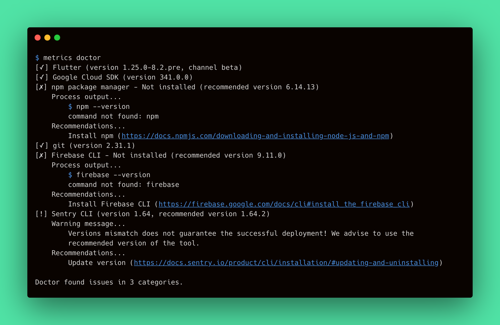
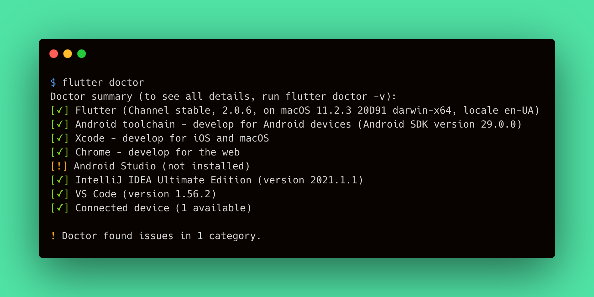
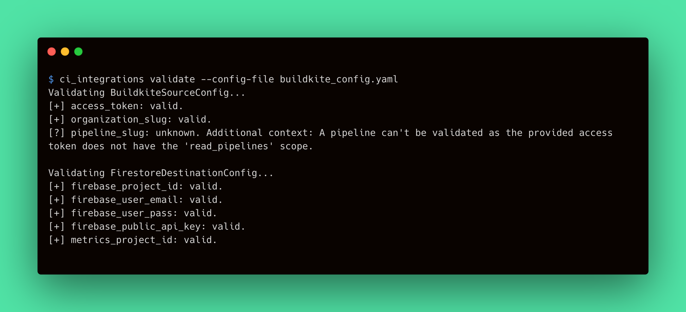

# Doctor Output Improvements

The Metrics CLI `doctor` command checks all third-party CLI tools that participate in a deployment process. As the command is to be generally used by end-users, we should improve the output of the `doctor` command to make it more comfortable.

## Contents

- [**Analysis**](#analysis)
    - [Feasibility study](#feasibility-study)
    - [Requirements](#requirements)
    - [Landscape](#landscape)
    - [Prototyping](#prototyping)
    - [System modeling](#system-modeling)
- [**Design**](#design)
    - [Architecture](#architecture)
      - [ValidationTarget](#validationtarget)
      - [ValidationConclusion](#validationconclusion)
      - [TargetValidationResult](#targetvalidationresult)
      - [ValidationResult](#validationresult)
      - [ValidationResultBuilder](#validationresultbuilder)
      - [ValidationResultPrinter](#validationresultprinter)
    - [User Interface](#user-interface)
    - [Program](#program)
      - [Refactor the `CI Integrations Validate` command](#refactor-the-ci-integrations-validate-command)
        - [ConfigFieldValidationConclusion](#configfieldvalidationconclusion)
        - [CoolIntegrationSourceValidationTarget](#coolintegrationsourcevalidationtarget)
        - [CoolIntegrationSourceValidationDelegate](#coolintegrationsourcevalidationdelegate)
        - [CoolIntegrationSourceValidator](#coolintegrationsourcevalidator)
        - [CI Integrations. Making things work](#ci-integrations-making-things-work)
      - [Update the `Metrics CLI Doctor` command](#update-the-metrics-cli-doctor-command)
        - [DoctorCommand](#doctorcommand)
        - [Doctor](#doctor)
        - [VersionHelper](#versionhelper)
        - [Doctor. Making things work](#doctor-making-things-work)

## Analysis

The following analysis discovers the Metrics CLI `doctor` command output improvements feature. This feature purposes to improve the output of the `doctor` command in a way it would be clearer for users.

The analysis defines the requirements for the feature, studies its feasibility, and states the implementation approach.

### Feasibility Study
> A preliminary study of the feasibility of implementing this feature.

The `doctor` command should provide clear and readable results, so the user can study them and perform additional configurations on their machine if necessary. Hence, the `doctor` command output is critical for a successful deployment of the Metrics applications. We should ensure that users won't be confused, by providing a convenient, fancy, and clear way to check the machine readiness for Metrics deployment. 

According to the above, we can conclude that the feature makes sense and the Metrics CLI `doctor` command output is to be improved. If a user decided to use Metrics CLI for deployment, it is critical to provide this user with a validation command having a human-friendly output.

To admit that this is possible to implement the feature, we can state that there are existing solutions that we've already implemented for the CI Integrations `validate` command. This command consumes the configuration file and validates its fields providing clear and readable results. Moreover, the Flutter `doctor` command validates the environment, as the Metrics CLI `doctor`, and provides a great output.

Therefore, the feature implementation is possible since the real-case examples exist.

### Requirements
> Define requirements and make sure that they are complete.

The `doctor` command performs the set of checks that validates whether the machine has the required third-party tools installed. Each check stands for a single validation item for the environment the Metrics CLI runs in. The `doctor` command output consists of a set of results for each validation item performed during the command run. Therefore, we can state that the command itself is a validation for the environment. This makes the `doctor` command similar to the CI Integrations `validate` command for [Config Validator](https://github.com/platform-platform/monorepo/blob/master/metrics/ci_integrations/docs/04_ci_integrations_config_validator.md). Let's define the requirements for the output improvements feature:

- A single check shouldn't output log messages to the user's console to avoid confusion.
- A single check shouldn't output errors to the user's console to avoid confusion.
- Single check output should start with a leading box with an indicator that clearly defines the result of the validation.
     - The successful validation should start with the mark sign in brackets: `[✓]`.
     - The failed validation should start with the cross sign in brackets: `[✗]`.
     - The validation that finishes successfully but has warnings should start with the exclamation sign in brackets: `[!]`.
     - The validation with an unknown result should start with the question mark in brackets: `[?]`.
- Single check output should contain the validation item name or its description to define the target of validation.
- Single check output may contain the validation result description if any.
- A single check should contain the additional output of the appropriate process. This output is optional by default for the successful checks and is required for fail, warning, and unknown results.
- A single check additional output should be human-readable and decoupled from the main result according to the following rules:
     - The output has a four-space indent. 
     - The output low-level details have the greater indent (plus four spaces for each indentation level).

The following table summarizes the above requirements into the validation result components:

||Indicator|Target|Description|Output|
|---|---|---|---|---|
|**Success**|`[✓]`|Name or description|The result description (e.g., version of the tool). Could be empty|Optional. May contain the human-readable check result|
|**Fail**|`[✗]`|Name or description|Conclusion of validation (e.g., _Not installed_)|Required. Should contain the error message and its cause (e.g., command run)|
|**Warning**|`[!]`|Name or description|The result description and a short explanation of warning (e.g., when optional tool is not installed)|Required. Should contain the human-readable description of the warning (e.g., explanation of versions mismatch)|
|**Unknown**|`[?]`|Name or description|The short message (e.g., _Could not validate_)|Required. Should contain the explanation of why the check could not be performed|

Let's take a look at the example of how the improved `doctor` command output should look like:



### Landscape
> Look for existing solutions in the area.

As mentioned in the [Feasibility study](#feasibility-study) section, the Flutter CLI and CI Integrations tool provide similar to the desired output. Let's take a look at these examples:

- The Flutter `doctor` command validates the environment to be ready for development using Flutter SDK. The command output is clear and useful and provides the conclusion of the command run summarizing results.
     
     

- The CI Integrations `validate` command consumes the configuration file and validates its fields resulting in a clear output with conclusions for each field.

     

However, the Flutter `doctor` command implementation looks a bit tricky and doesn't provide appropriate interfaces we might use. On the other hand, the CI Integrations tool `validate` command provides validation classes and interfaces we would like to use.

As we've already implemented a similar output for the CI Integrations tool `validate` command, we'd like to use the existing code. Thus, the feature is preliminary custom and implies using the existing custom solution with general improvements.

Consider the [Config Validator](https://github.com/platform-platform/monorepo/blob/master/metrics/ci_integrations/docs/04_ci_integrations_config_validator.md) document to be more familiar with the `validate` command implementation and its output.

### Prototyping
> Create a simple prototype to confirm that implementing this feature is possible.

The feature implies writing results of validation checks to the console. The [`dart:io`](https://api.dart.dev/stable/dart-io/dart-io-library.html) library provides a convenient way of writing messages to the standard [output](https://api.dart.dev/stable/dart-io/stdout.html) and [error](https://api.dart.dev/stable/dart-io/stderr.html) using [`stdout`](https://api.dart.dev/stable/dart-io/stdout.html) and [`stderr`](https://api.dart.dev/stable/dart-io/stderr.html) respectively.

The Metrics CLI uses the [`process_run`](https://pub.dev/packages/process_run) package to run the executables from the environment. The [`runExecutableArguments`](https://pub.dev/documentation/process_run/latest/process_run.cmd_run/runExecutableArguments.html) method runs the executable and logs the process output if the given `verbose` is `true`. The `commandVerbose` flag stands for whether to log the command to execute - this flag is mandatory `true` if the `verbose` one is `true`. Both `commandVerbose` and `verbose` uses the standard output/error to log messages. To suppress the output, both `verbose` and `commandVerbose` should be `false`. So the following code won't log to the standard output:

```dart
final result = await runExecutableArguments(
     'flutter',
     ['--version'],
     verbose: false,
     commandVerbose: false,
);
```

To access the output/error logs from the process, we should use the resulting [ProcessResult](https://api.dart.dev/stable/dart-io/ProcessResult-class.html) instance. Its `stdout` and `stderr` contain the output of the process. We can handle the one as follows:

```dart
String extractOutput(ProcessResult result) {
     final output = result.stdout;
     if (output is String) {
          return output;
     }

     return systemEncoding.decode(output);
}
```

Other requirements match the usual string formatting in Dart.

### System modeling
> Create an abstract model of the system/feature.

The validation output classes and models are a part of the Metrics project and shared for all Metrics components. As both Metrics CLI and CI Integrations are to use the same output for their validation features, we should separate the related component making it a standalone component. This implies modifying the related implementations for the CI Integrations `validate` command.

The following component diagram describes the desired approach:


# Design

The following subsections explain the implementation strategy in more detail.

### Architecture
> Fundamental structures of the feature and context (diagram).
 
Since the validation output is similar for the [`CI Integrations Config Validator`](https://github.com/Flank/flank-dashboard/blob/master/metrics/ci_integrations/docs/04_ci_integrations_config_validator.md) and the `Metrics CLI Doctor`, we want to have a reusable API for the validation output for the components listed below. For that, let's create a `Validation` package to store the common abstractions of the validation functionality.

Consider the next sections describing the main classes of the `Validation` package.

#### ValidationTarget
A `ValidationTarget` is an entity which value is used in the validation process (e.g., it's a version of a CLI package). 

To represent a `ValidationTarget` in output to the user, we should know its name and a description.

#### ValidationConclusion
A `ValidationConclusion` represents a possible conclusion of the validation process (e.g., 'valid', 'invalid', 'unknown', 'not installed', etc.).

To represent a `ValidationConclusion` to a user, we should know its name, and a visual indicator (e.g., '[+]', '[-]', '[?]', etc.).

#### TargetValidationResult
A `TargetValidationResult` represents a result of the validation of some `ValidationTarget`.

The `TargetValidationResult` should include the following fields:
- A `ValidationTarget` used in the validation process;
- A `ValidationConclusion` of the validation; 
- A description of this conclusion;
- An additional details of this conclusion;
- A context of this conclusion (e.g., process output, additional recommendations, etc.).

#### ValidationResult
A `ValidationResult` is a class that holds the validation results for each `ValidationTarget`.

#### ValidationResultBuilder 
A `ValidationResultBuilder` is a class that simplifies the creation of the `ValidationResult`. The `ValidationResultBuilder` has the main build method that returns a `ValidationResult`.

This class implements a `Builder` pattern, and its responsibility is to assemble the `ValidationResult` step by step.

#### ValidationResultPrinter
A `ValidationResultPrinter` is a class that is responsible for showing the validation result to the user.

Consider the following class diagram that describes the `Validation` package structure:


### User Interface
> How users will interact with the feature (API, CLI, Graphical interface, etc.).

The usage of the `doctor` command will not change for the user. To run the `doctor` command, use the following command in the directory containing the Metrics CLI tool:

```bash 
./metrics doctor
```

The improved output of the feature will contain the detailed validation result as described in the ["Requirements"](#requirements) section above. 

After we clarified the general architecture and usage, let's proceed to the detailed implementation approach.

### Program
> Detailed solution description to class/method level.

The improvement of the doctor command output involves two main steps to implement:
1. [Refactor the `CI Integrations Validate` command](#refactor-the-ci-integrations-validate-command).
2. [Update the `Metrics CLI Doctor` command](#update-the-metrics-cli-doctor-command);

Consider the following subsections that describe each step in more detail.

#### Refactor the `CI Integrations Validate` command

As stated above, the `Metrics CLI` and [`CI Integrations`](https://github.com/Flank/flank-dashboard/tree/master/metrics/ci_integrations) have a similar logic for the validation process. That's why we want to reuse the code across those tools to make it more DRY.

This section describes the modifications that should be made to the `CI Integrations` tool to use the common code from the `Validation` package.

Assume a `CoolIntegration` as a source party for which we want to provide the config validation. Consider the following subsections that describe the changes required to validate the config for the `CoolIntegration`.

##### ConfigFieldValidationConclusion

The `ConfigFieldValidationConclusion` (previous `FieldValidationConclusion`) is a class that represents a validation conclusion for a specific config field.

In the scope of this feature, the `ConfigFieldValidationConclusion` should aggregate the `ValidationConclusion`s that are necessary for the config validation.


##### CoolIntegrationSourceValidationTarget

The `CoolIntegrationSourceValidationTarget` (previous `CoolIntegrationSourceConfigField`) is a model that represents the config fields for the specific `CoolIntegration`.

We need to update this class to aggregate the `ValidationTarget`s (previous `ConfigField`s) of the given `CoolIntegration`.


##### CoolIntegrationSourceValidationDelegate

The `CoolIntegrationSourceValidationDelegate` is a class that validates the specific fields with network calls. The methods of `CoolIntegrationSourceValidationDelegate` return the `TargetValidationResult`s which are then used to compose the `ValidationResult`.

We need to update this class to utilize the `TargetValidationResult`s
instead of the outdated `FieldValidationResult`s.

##### CoolIntegrationSourceValidator

The `CoolIntegrationSourceValidator` is a class responsible for the validation of the corresponding config file.

The `.validate()` method of the `CoolIntegrationSourceValidator` should return the `ValidationResult` containing `TargetValidationResult` for each field of the `CoolIntegrationSourceValidationTarget`.

##### CI Integrations. Making things work

Consider the following steps needed to update the `CI Integrations Validate` command:
1. Create the main abstractions in the `Validation` package: `ValidationTarget`, `ValidationConclusion`, `TargetValidationResult`, `ValidationResult`, `ValidationResultBuilder`, `ValidationResultPrinter`.
2. Update the `ConfigFieldValidationConclusion` and `CoolIntegrationSourceValidationTarget` to use the `ValidationConclusion` and `ValidationTarget` respectively.
3. Update the validation methods of each integration's validation delegate to return the `TargetValidationResult`.
4. Update the `.validate()` methods of each validator to return the updated `ValidationResult` containing the `ValidationTarget`s and `TargetValidationResult`s.
5. Delete the outdated abstractions covered by the `Validation` package: `ValidationTarget`, `ValidationConclusion`, `TargetValidationResult`, `ValidationResult`, `ValidationResultBuilder`, `ValidationResultPrinter`.

Consider the following diagrams that demonstrate the updated config validation for the `CoolIntegration`:

- Class diagram:
  

- Sequence diagram:
  

#### Update the `Metrics CLI Doctor` command

This subsection describes the enhancements needed to implement in the `Metrics CLI` tool to improve the `doctor` command output.

##### DoctorCommand

The `DoctorCommand` is the Metrics CLI command that verifies all required 3-rd party tools' versions against the [list of recommended versions](https://github.com/Flank/flank-dashboard/blob/master/metrics/cli/recommended_versions.yaml).

In the scope of this feature, we need to update the `DoctorCommand` class to be responsible for printing the [`ValidationResult`](#validationresult) using the [`ValidationResultPrinter`](#validationresultprinter).

##### Doctor

The `Doctor` is a class used to check whether all required third-party CLIs are installed and get their versions. This class encapsulates the logic of the `DoctorCommand` and interacts with the 3-rd party services.

We need to update the `.checkVersions()` method of the `Doctor` class to return the `ValidationResult` that will be printed by the `DoctorCommand`.

The `ValidationResult` contains the `TargetValidationResult`s returned by the `.checkVersion()` methods of each 3-rd party service.

##### VersionHelper

The `VersionHelper` is a new class that allows us to interact with the [list of recommended versions](https://github.com/Flank/flank-dashboard/blob/master/metrics/cli/recommended_versions.yaml).

The `.getRecommenedVersion()` method takes the name of the service and returns the recommended version for this service.

##### Doctor. Making things work

Consider the following steps needed to be able to improve the doctor command output:
1. Create the `VersionHepler` class to work with the recommended versions of each service.
2. Update the `.version()` methods of each service cli to return the `ProcessResult`.
3. Update the `.checkVersion()` methods of each service adapter to return the `TargetValidationResult`.
4. Update the `.checkVersions()` method of the `Doctor` class to return the `ValidationResult`.
5. Update the `DoctorCommand` to print the `ValidationResult` via the `ValidationResultPrinter`.

Assume a `CoolService` as a 3-rd party service for which we want to improve `doctor` command output. Consider the following diagrams that demonstrate the implementation of the `doctor` command output improvement:

- Class diagram:
  

- Sequence diagram:
  