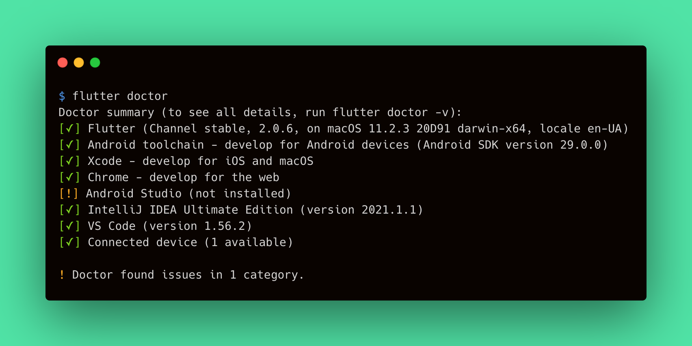
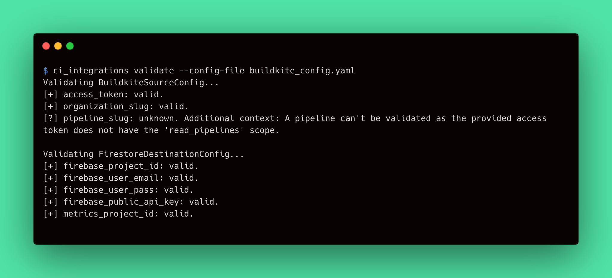
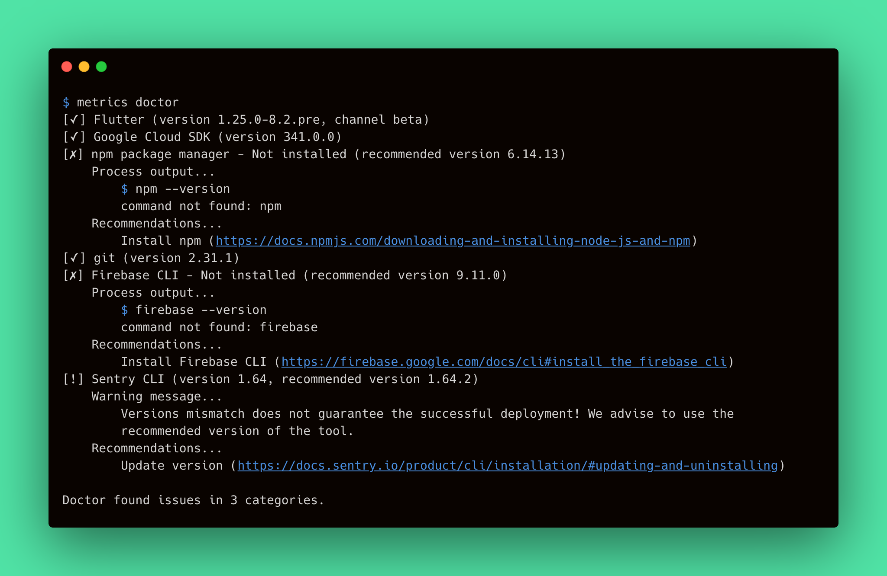

# Doctor Output Improvements

The Metrics CLI `doctor` command checks all third-party CLI tools that participate in a deployment process. As the command is to be generally used by end-users, we should improve the output of the `doctor` command to make it more comfortable.

## Contents

- [**Analysis**](#analysis)
    - [Feasibility study](#feasibility-study)
    - [Requirements](#requirements)
    - [Landscape](#landscape)
    - [Prototyping](#prototyping)
    - [System modeling](#system-modeling)

## Analysis

The following analysis discovers the Metrics CLI `doctor` command output improvements feature. This feature purposes to improve the output of the `doctor` command in a way it would be clearer for users.

The analysis defines the requirements for the feature, studies its feasibility, and states the implementation approach.

### Feasibility Study
> A preliminary study of the feasibility of implementing this feature.

The `doctor` command should provide clear and readable results, so the user can study them and perform additional configurations on their machine if necessary. Hence, the `doctor` command output is critical for a successful deployment of the Metrics applications. We should ensure that users won't be confused, by providing a convenient, fancy, and clear way to check the machine readiness for Metrics deployment. 

According to the above, we can conclude that the feature makes sense and the Metrics CLI `doctor` command output is to be improved. If a user decided to use Metrics CLI for deployment, it is critical to provide this user with a validation command having a human-friendly output.

To admit that this is possible to implement the feature, let's take a look at the existing examples:

- Flutter provides a similar `doctor` command that validates the environment to be ready for development using Flutter SDK. The command output is clear and useful and provides the conclusion of the command run summarizing results.
     
     

- The Ci Integrations `validate` command consumes the configuration file and validates its fields resulting in a clear output with conclusions for each field.

     

Therefore, the feature implementation is possible since the real-case examples exist.

### Requirements
> Define requirements and make sure that they are complete.

The `doctor` command performs the set of checks that validates whether the machine has the required third-party tools installed. Each check stands for a single validation item for the environment the Metrics CLI runs in. The `doctor` command output consists of a set of results for each validation item performed during the command run. Therefore, we can state that the command itself is a validation for the environment. This makes the `doctor` command similar to the CI Integrations `validate` command for [Config Validator](https://github.com/platform-platform/monorepo/blob/master/metrics/ci_integrations/docs/04_ci_integrations_config_validator.md). Let's define the requirements for the output improvements feature:

- A single check shouldn't output log messages to the user's console to avoid confusion.
- A single check shouldn't output errors to the user's console to avoid confusion.
- Single check output should start with a leading box with an indicator that clearly defines the result of the validation.
     - The successful validation should start with the mark sign in brackets: `[✓]`.
     - The failed validation should start with the cross sign in brackets: `[✗]`.
     - The validation that finishes successfully but has warnings should start with the exclamation sign in brackets: `[!]`.
     - The validation with an unknown result should start with the question mark in brackets: `[?]`.
- Single check output should contain the validation item name or its description to define the target of validation.
- Single check output should contain the validation result description (could be empty).
- A single check should contain the additional output of the appropriate process. This output is optional by default for the successful checks and is required for fail, warning, and unknown results.
- A single check additional output should be human-readable and highlighted from the main result according to the following rules:
     - The output has a four-space indent. 
     - The output low-level details have the greater indent (plus four spaces for each indentation level).

The following table summarizes the above requirements into the validation result components:

||Indicator|Target|Description|Output|
|---|---|---|---|---|
|**Success**|`[✓]`|Name or description|The result description (e.g. version of the tool). Could be empty|Optional. May contain the human-readable check result|
|**Fail**|`[✗]`|Name or description|Conclusion of validation (e.g. _Not installed_)|Required. Should contain the error message and its cause (e.g. command run)|
|**Warning**|`[!]`|Name or description|The result description and a short explanation of warning (e.g. when optional tool is not installed)|Required. Should contain the human-readable description of the warning (e.g. explanation of versions mismatch)|
|**Unknown**|`[?]`|Name or description|The short message (e.g. _Could not validate_)|Required. Should contain the explanation of why the check could not be performed|

Let's take a look at the example of how the improved `doctor` command output should look like:



### Landscape
> Look for existing solutions in the area.

As mentioned in the [Feasibility study](#feasibility-study) section, the Flutter CLI and CI Integrations tool provide similar to the desired output. However, the Flutter `doctor` command implementation looks a bit tricky and doesn't provide appropriate interfaces we might use. On the other hand, the CI Integrations tool `validate` command provides similar output as well as validation classes and interfaces we would like to use.

As we've already implemented a similar output for the CI Integrations tool `validate` command, we'd like to use the existing code. Thus, the feature is preliminary custom and implies using the existing custom solution with general improvements.

Consider the [Config Validator](https://github.com/platform-platform/monorepo/blob/master/metrics/ci_integrations/docs/04_ci_integrations_config_validator.md) document to be more familiar with the `validate` command implementation and its output.

### Prototyping
> Create a simple prototype to confirm that implementing this feature is possible.

The feature implies writing results of validation checks to the console. The [`dart:io`](https://api.dart.dev/stable/dart-io/dart-io-library.html) library provides a convenient way of writing messages to the standard [output](https://api.dart.dev/stable/dart-io/stdout.html) and [error](https://api.dart.dev/stable/dart-io/stderr.html) using [`stdout`](https://api.dart.dev/stable/dart-io/stdout.html) and [`stderr`](https://api.dart.dev/stable/dart-io/stderr.html) respectively.

The Metrics CLI uses the [`process_run`](https://pub.dev/packages/process_run) package to run the executables from the environment. The [`runExecutableArguments`](https://pub.dev/documentation/process_run/latest/process_run.cmd_run/runExecutableArguments.html) method runs the executable and logs the process output if the given `verbose` is `true`. The `commandVerbose` flag stands for whether to log the command to execute - this flag is mandatory `true` if the `verbose` one is `true`. Both `commandVerbose` and `verbose` uses the standard output/error to log messages. To suppress the output, both `verbose` and `commandVerbose` should be `false`. So the following code won't log to the standard output:

```dart
final result = await runExecutableArguments(
     'flutter',
     ['--version'],
     verbose: false,
     commandVerbose: false,
);
```

To access the output/error logs from the process, we should use the resulting [ProcessResult](https://api.dart.dev/stable/dart-io/ProcessResult-class.html) instance. Its `stdout` and `stderr` contain the output of the process. We can handle the one as follows:

```dart
String extractOutput(ProcessResult result) {
     final output = result.stdout;
     if (output is String) {
          return output;
     }

     return systemEncoding.decode(output);
}
```

Other requirements match the usual string formatting in Dart.

### System modeling
> Create an abstract model of the system/feature.

The validation output classes and models are a part of the Metrics project and shared for all Metrics components. As both Metrics CLI and CI Integrations are to use the same output for their validation features, we should separate the related component making it a standalone component. This implies modifying the related implementations for the CI Integrations `validate` command.

The following component diagram describes the desired approach:


