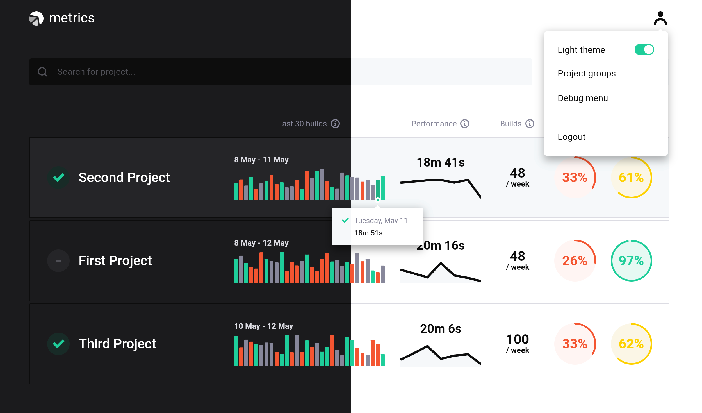
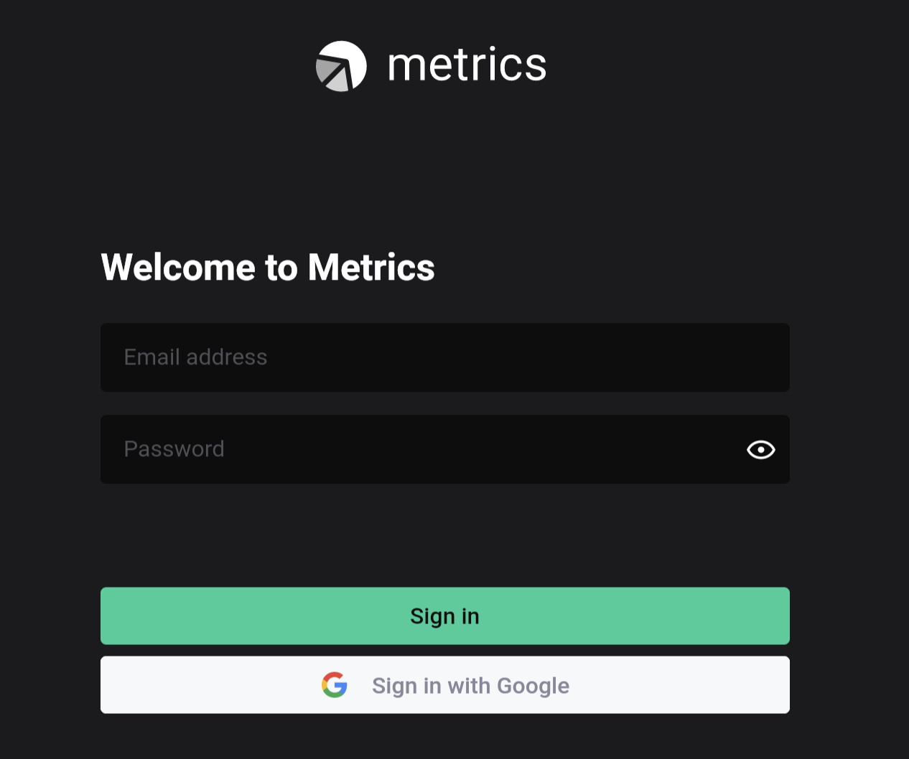

Metrics is a set of software components to collect and review software project metrics like performance, build stability, and codebase quality.

# About Metrics :bar_chart:

We believe Metrics will help you to monitor the quality of your project's codebase and processes. Metrics application helps developers, project teams, and organizations to monitor and improve projects' performance, stability, and quality.

### Attractive

The Metrics Web Application provides a beautiful and handy UI delivered by creative designers and developers. The web application is powered by [Flutter](https://flutter.dev) making it fast and reliable. The UI visualizes the project's metrics and makes it easier to monitor metrics for different projects by providing appropriate filters.

### Fully Integrated

The Metrics software components consist of a set of tools that provide a convenient way to deploy components, synchronize project data, configure logging, and collecting analytics. Moreover, the CI Integrations Tool can be integrated into the project's CI to automate builds synchronization and provide up-to-date data to the Web Metrics Application.

  
Metrics Components

#### CI integrations

A CLI application that integrates with popular CI tools to collect software project metrics.

#### Core

A Dart package that provides a common classes to use within Metrics applications.

#### Firebase

A `Firebase` instance that provides the Firestore, Firebase Cloud Functions services and ability to deploy the application on Firebase Hosting. Also, provides an Analytics service used to gather and store the analytics data (this service is optional and may not be configured during deployment).

Firebase Analytics is optional and may not be configured during deployment.

#### Flutter Web

A `Flutter Web` application that displays project metrics on easy to navigate Dashboard.

#### Deploy CLI

A `Deploy CLI` is a command-line tool that simplifies the deployment of Metrics components (Flutter Web application, Cloud Functions, etc.)

#### Dart Cloud Functions

A `Dart Cloud Functions` is a serverless backend code deployed on Firebase that simplifies data managing for other Metrics components.

#### Sentry

A `Sentry` service helps to store any logs and monitor runtime errors.

Sentry is optional and may not be configured during deployment.

### Safe

All the data that the Metrics components orchestrate, belongs only to you: it is stored in the Cloud Firestore database as a part of your Firebase project, the logging is performed on your Sentry account, if enabled, analytics are reported to your Firebase Analytics account, and so on. Moreover, to make the components even safer, we provide a great set of [Firestore Security rules](https://firebase.google.com/docs/firestore/security/get-started) for Cloud Firestore to protect the stored projects' data. The [Firebase Authentication](https://firebase.google.com/docs/auth) stands on the guard of the deployed web application and the stored data from insufficient access.

### Configurable

The Metrics components are configurable on your demand. You can always integrate the builds synchronization into your CI system or schedule this synchronization, disable or enable Sentry logging and Firebase Analytics, configure the web application authentication processes, and so on.

# Getting started with Metrics :beginner:

We've tried to document all important decisions & approaches used for the development of this project. Reading each document is not an easy task and requires some time and patience. To help you get started, we collected the most useful documents that should help you to make fist steps:

1. [Metrics developer configuration :gear:](../docs/14_developer_configuration.md)
2. [Why create a metrics platform? :thinking:](../docs/01_design_doc.md)
3. [GitHub Agile process :chart_with_upwards_trend:](../docs/02_process.md)
4. [Dart code style :nail_care:](../docs/09_dart_code_style.md)
5. [Collaboration :raised_hands:](../docs/10_collaboration.md)

Furthermore, every Metrics component requires component-specific documentation. Thus, to get started with the `CI integrations` it is recommended to get familiar with the following documents:
1. [CI integrations module architecture :building_construction:](../metrics/ci_integrations/docs/01_ci_integration_module_architecture.md)

Similarly, here is a list for the `Firebase` component:
1. [Metrics firebase deployment :boat:](../docs/08_firebase_deployment.md)

In contrast with the above components, `Flutter Web` requires more steps to follow:
1. [Project metrics definitions :book:](../docs/05_project_metrics.md)
2. [Metrics Web Application architecture :walking:](web/docs/01_metrics_web_application_architecture.md)
3. [Metrics Web presentation layer architecture :running:](web/docs/02_presentation_layer_architecture.md)
4. [Widget structure organization :bicyclist:](web/docs/03_widget_structure_organization.md)
