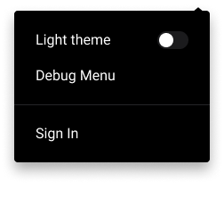

# Public Dashboard
> Feature description / User story.

As a user, I want to be able to enable public access to the dashboard page in my `Metrics Web` application instance for everyone.

## Contents

- [**Analysis**](#analysis)
    - [Feasibility study](#feasibility-study)
    - [Requirements](#requirements)
    - [Landscape](#landscape)
        - [Saving public dashboard configuration](#Saving-public-dashboard-configuration)
        - [Disabling the authentication in the Metrics Web application](#Disabling-the-authentication-in-the-Metrics-Web-application)
            - [Do not authenticate the user](#Do-not-authenticate-the-user)
            - [Authenticate as an anonymous user](#Authenticate-as-an-anonymous-user)
    - [Prototyping](#prototyping)
    - [System modeling](#system-modeling)
- [**Design**](#design)
    - [Architecture](#architecture)
    - [User Interface](#user-interface)
    - [Database](#database)
    - [Privacy](#privacy)
    - [Security](#security)
    - [Program](#program)

# Analysis
> Describe a general analysis approach.

During the analysis process, we are going to review all approaches we can apply during the development and define requirements for the Public Dashboard feature.

### Feasibility study
> A preliminary study of the feasibility of implementing this feature.

Since the `Metrics Web` application allows tracking the project metrics, it may be useful for users to be able to access these metrics without any authentication. For example, authors of an open-source project can leave a link to the project metrics in a readme file and so the users can access the dashboard.

### Requirements
> Define requirements and make sure that they are complete.

This feature should accept the following requirements: 

- The public dashboard feature should be configurable within the Metrics Web application instance.
- The dashboard page should be opened without authentication if the public dashboard feature is enabled.
- The information on the dashboard page should be available without authentication if the public dashboard feature is enabled.
- The project groups page is not available for an unauthenticated user even if the public dashboard feature is enabled.
- An unauthenticated user should be able to sign in to the Metrics Web application using the `Sign in` option in the user menu.

### Landscape
> Look for existing solutions in the area.

To implement this feature, we should decide which approach we are going to use for the following use cases: 

- [Saving public dashboard configuration](#Saving-public-dashboard-configuration). 
- [Disabling the authentication in the `Metrics Web` application](#Disabling-the-authentication-in-the-Metrics-Web-application).

Let's consider the landscape for these use cases separately: 

#### Saving public dashboard configuration 
> Look for existing solutions for saving the public dashboard configuration.

Since enabling and disabling the public dashboard in the `Metrics Web` application is a feature configuration, we are going to store this configuration according to the [Feature Config](https://github.com/Flank/flank-dashboard/blob/master/metrics/web/docs/features/feature_config/01_feature_config_design.md) design document - in the `feature_config` document under the `feature_config` collection in the Firestore database.

#### Disabling the authentication in the Metrics Web application
> Look for existing solutions for disabling the authentication in the Metrics Web applicaiton.

We have the following approaches for disabling the authentication in the `Metrics Web` application: 

- [Do not authenticate the user](#Do-not-authenticate-the-user) if the public dashboard is enabled.
- [Authenticate the user as an anonymous one](#Authenticate-as-an-anonymous-user) when the application opens if the public dashboard is enabled.

Let's consider these approaches and their pros and cons: 

##### Do not authenticate the user
> Describe the approach and provide its pros and cons.

The first approach implies the full disabling of the authentication feature and allowing the user to access the `Metrics Web` application dashboard page without logging in. 

Let's review the pros and cons of this approach: 

Pros: 
- Does not store any user information (like a selected theme) in the database if the user is not authenticated.

Cons: 
- Requires significant changes in the Firebase security rules.
- Complexifies Firestore Security rules testing and maintaining.
- Requires more boilerplate code to implement the feature.
- Requires additional mechanism of saving the user-selected theme.
- Requires additional changes to the code related to the app navigation.
- Does not allow using Firebase Analytics.

##### Authenticate as an anonymous user
> Describe the approach and provide its pros and cons.

Another approach is to use the `Firebase` anonymous users if the public dashboard is enabled. It means that we will log in users anonymously on the application opening.

Let's review what does anonymous log-in means. It means that we are creating a user record in the Firebase without having any information about the user like email, password, etc. Since there is no need for user interaction (like entering any email/password and so on) to log in anonymously, we can make it automatically on application startup. Once the user logs in anonymously, the `FirebaseAuth.onAuthStateChanged` emits a new anonymous user. The anonymous user has an identifier that allows us to create a user profile and save the user-specific data as if a user would log in as usual.

Also, according to the [Firebase Authentication](https://firebase.flutter.dev/docs/auth/usage/#anonymous-sign-in) documentation, the user is saved through application sessions. It means that the user doesn't lose their data, like selected theme, on application closes or browser page refreshes. The initially created anonymous account will not persist on the next sign-in in the following cases:

- The user signed out from the anonymous account.
- The user clears their browser storage.
- The user opens the application using the private browsing method (for example, using incognito mode in the Google Chrome browser).

Consider the pros and cons of this approach: 

Pros: 
- Requires minimal changes in Firebase security rules.
- Does not require changes in saving the user-selected theme.
- Requires minimal changes in the currently existing codebase.
- Leaves an ability to gather analytics for non-authenticated users (authenticated anonymously).

Cons:
- Still saves the user information to the Firestore.
- May significantly increase the number of user profiles stored in the Firestore database.

Since using the Firebase anonymous user allows us to not change the process of storing the user information like selected theme and requires minimal changes in the existing codebase, we are going to use an existing approach with the Firebase anonymous user.

### Prototyping
> Create a simple prototype to confirm that implementing this feature is possible.

To provide the authentication feature config, we should be able to authenticate a user as an anonymous one on the application startup. Since the `Metrics Web` application has initializing phase on application startup, we can log in users on this phase. 

Let's review the code snippet showing the process of authenticating the user as an anonymous one: 

```dart
final firebaseAuth = FirebaseAuth.instance;

await firebaseAuth.signInAnonymously();
```

Once we've figured out that we can sign in anonymously, let's consider the code snippet proving that we are able to detect whether the Firebase user is anonymous: 

```dart
final user = await firebaseAuth.currentUser();

final isAnonymous = user.isAnonymous;
```

Since we can log in users without any user interaction and check whether the user is anonymous, we can state that the feature implementation is possible. 

### System modeling
> Create an abstract model of the system/feature.

Once we've chosen the implementation approach, let's consider the components diagram displaying the components that should be added/modified to implement this feature: 


# Design

The following sections explains the implementation details of the public dashboard feature.

### Architecture
> Fundamental structures of the feature and context (diagram).

Once we've chosen the implementation approach of the public dashboard, let's consider the top-level class diagram explaining the main classes and their relationships needed to implement this feature.


As we can see on the diagram, we need to implement the following classes: 
- [PublicDashboardFeatureConfigModel](#PublicDashboardFeatureConfigModel)
- [UserProfileViewModel](#UserProfileViewModel)
- [SignInAnonymouslyUseCase](#SignInAnonymouslyUseCase)

Let's consider each class in a bit more detail: 

#### PublicDashboardFeatureConfigModel
> Explain the purpose and responsibility of the class.

Since we are going to store the public dashboard configuration in the Firestore database and the `FeatureConfigNotifier` manages the application state related to the feature configuration, we should be able to transfer the configuration of the public dashboard feature between different states. According to the [Presentation Layer Architecture](https://github.com/Flank/flank-dashboard/blob/master/metrics/web/docs/02_presentation_layer_architecture.md#model) document, to transfer the data between the states, we should use the `model` classes. So, for this purpose, we should create a `PublicDashboardFeatureConfigModel` that will be used to transfer the public dashboard feature configuration from the `FeatureConfigNotifier` to any other state in the application. 

#### UserProfileViewModel
> Explain the purpose and responsibility of the class.

Since we want to disable some features on the UI if the user is anonymous, we should be able to access the user profile from the UI. As the [Presentation Layer Architecture](https://github.com/Flank/flank-dashboard/blob/master/metrics/web/docs/02_presentation_layer_architecture.md#view-model) document states, we should create a view model to be able to access the data from the `state` on the UI. So, we should create a view model representing a user profile to disable the `Project Groups` page and provide the ability to `Sign In` to the application for the anonymous users.

#### SignInAnonymouslyUseCase
> Explain the purpose and responsibility of the class.

Since the public dashboard feature implies logging in as an anonymous user, we should create a use case needed to log in to the application using the anonymous user. 

### User Interface
> How users will interact with the feature (API, CLI, Graphical interface, etc.).

Since the non-authorized users should not be able to access the `Project Groups` page, it should be hidden from the user menu for such users. Also, there should be an ability to sign in for anonymous users, so we should change the `Logout` button from the user menu to `Sign in` one. 

Let's consider the user menu UI in case we are using an anonymous user: 



### Database
> How relevant data will be persisted and protected.

The public dashboard menu requires changes in the `Firestore` database that can be divided into two different parts:

- [Storing the public dashboard configuration](#Storing-the-public-dashboard-configuration).
- [Accessing the data using the anonymous user](#Accessing-the-data-using-the-anonymous-user).

Let's consider each of them in more detail: 

#### Storing the public dashboard configuration
> Explain the way we are going to store the public dashboard configuration.

As we've mentioned above, we are going to store the public dashboard configuration as a [Feature Config](https://github.com/Flank/flank-dashboard/blob/master/metrics/web/docs/features/feature_config/01_feature_config_design.md) - in the `feature_config` document, under the `feature_config` collection. So, let's review the `feature_config` document structure, including the `public dashboard` configuration: 

```json
{
    isDebugMenuEnabled: bool,
    isPasswordSignInOptionEnabled: bool,
    isPublicDashboardEnabled: bool
}
```

Since these changes do not require creating any new collections/documents, the Firestore Security rules should not be changed. 

#### Accessing the data using the anonymous user
> Explain the changes required to make the data accessible for anonymous users.

There is no need to change the `Firestore` database structure to access the data using the anonymous user. But we should change the `Firestore` security rules for these purposes. So, we should allow access to the data that requires authentication for users logged in anonymously. 

Let's review the security rules for anonymous users in more detail: 

- The user logged in anonymously should be able to read the `projects` collection if the `isPublicDashboardEnabled` field of the `feature_config` document is `true`. 
- The user logged in anonymously should not be able to write to the `projects` collection.
- The anonymous user should be able to read the `builds` collection if the `isPublicDashboardEnabled` field of the `feature_config` document is true.
- The anonymous user should not be able to write to the `builds` collection. 
- The user logged in anonymously should be able to read the `project_groups` collection if the public dashboard feature is enabled.
- The anonymous user should not be able to write to the `project_groups` collection. 
- The user logged in anonymously should be able to read only their profile document (document with the user identifier as document identifier) from the `user_profiles` collection if the public dashboard feature is enabled.
- The user logged in anonymously should be able to create/update their profile (document with the user identifier as document identifier) in the `user_profiles` collection if the public dashboard feature is enabled.
- The anonymous user should be able to read the data from the `build_days` collection if the public dashboard feature is enabled. 
- The anonymous user should not be able to write to the `build_days` collection.

Please, note that if the collection is not mentioned in the list above, the collection rules should stay as is.

### Privacy
> Privacy by design. Explain how privacy is protected (GDPR, CCPA, HIPAA, etc.).

### Security
> How relevant data will be secured (Data encryption at rest, etc.).

### Program
> Detailed solution description to class/method level.