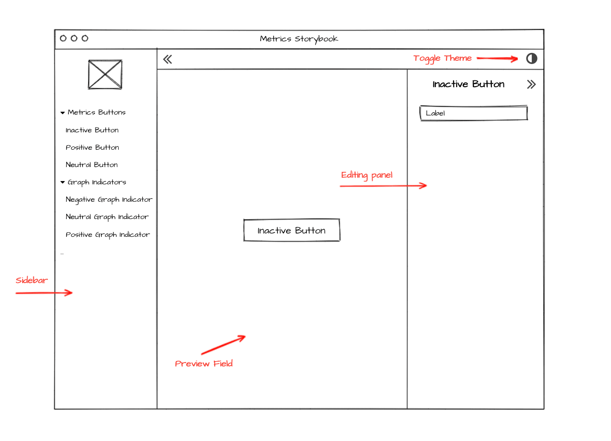

# Metrics Storybook
> Feature description / User story.

The Storybook is a tool for UI development that allows building UI components in isolation. It provides a convenient way to browsing a components library, viewing their different states and use cases, and interactively test them. Creating a UI library allows designers, project managers, and developers to collaborate in delivering the most beautiful and clear UI components.

## Contents

- [**Analysis**](#analysis)
    - [Feasibility study](#feasibility-study)
    - [Requirements](#requirements)
    - [Landscape](#landscape)
        - [Use existing packages](#use-existing-packages)
            - [Storyboard](#storyboard)
            - [Monarch](#monarch)
            - [Dashbook](#dashbook)
            - [Storybook_flutter](#storybook_flutter)
        - [Manually create a Storybook from scratch](#manually-create-a-storybook-from-scratch)
        - [Decision](#decision)
    - [Prototyping](#prototyping)
    - [System modeling](#system-modeling)
- [**Design**](#design)
    - [Architecture](#architecture)
    - [User Interface](#user-interface)
    - [Program](#program)

# Analysis
> Describe a general analysis approach.

This analysis purposes to discover the feasibility of implementing the feature and the requirements list for the feature to implement. The Metrics Storybook feature requires defining the set of UI elements of the Metrics Web Application that we should present on the storybook. 

The analysis examines the possible solutions for the feature implementation and compares these solutions using the project's architecture rules and principles. Then, the document states the general approach of implementing the Metrics Storybook and defines whether it should be a custom implementation or the existing solution.

### Feasibility study
> A preliminary study of the feasibility of implementing this feature.

Flutter allows us to create separate widgets that we can reuse and combine later to build a specific project. Also, we can build an interface to display these widgets to end-users and control their appearance through themes and properties.

Given the above, it's possible to create the `Metrics storybook`.

This feature will be useful to the following end-users: developers, designers, and clients.

First of all, the great purpose of the Metrics storybook is that each widget and story (a specific state of a widget) can be easily reused across the entire project by any developer who works on it, ensuring consistent design and UX. Metrics storybook creating allows developers to work in parallel on widgets and do not touch the main Metrics Web Application's codebase. It also makes it easier to add new widgets since we can test them separately and only then make changes in the application code.

The storybook application can be shared with and commented on by designers so that they can add their input regarding the implementation of the designs.

Another group that can use this feature is clients. Storybook makes it easy to show pieces of the software to keep the client in the loop. Even small pieces of UI can be shared and made available for feedback, preventing longer periods without any deliverables.

### Requirements
> Define requirements and make sure that they are complete.

Before defining requirements to the feature, we should determine which components from the Metrics Web Application the storybook should include.

There are [two types of widgets](https://github.com/Flank/flank-dashboard/blob/master/metrics/web/docs/03_widget_structure_organization.md#widget-creation-guidelines):
 - *base* - a widget that is responsible for only displaying the given data. These widgets should be highly configurable and usable out of the Metrics Web Application context.
 - *common* - is a widget that is actually used in the Metrics Web Application context and can be used across the modules.

The main question is whether we want to extract to the Metrics storybook only base widgets or add common widgets as well. If we add only base widgets to the storybook, we can accidentally duplicate the existing common Metrics widgets with the same functionality. Also, we will not be able to view the entire list of possible components that are used in the application. That's why our choice is to take out base widgets together with common ones.

At the same time, some of the common Metrics widgets (e.g., [MetricsUserMenu](https://github.com/Flank/flank-dashboard/blob/master/metrics/web/lib/common/presentation/widgets/metrics_user_menu.dart)) are using [ChangeNotifiers](https://pub.dev/documentation/provider/latest/provider/ChangeNotifierProvider-class.html) internally. It makes widgets dependent on the Metrics Web Application's notifiers, so in these cases, we cannot extract this kind of widget, without changing them.

According to the [widget structure organization document](https://github.com/Flank/flank-dashboard/blob/master/metrics/web/docs/03_widget_structure_organization.md#applying-a-theme-to-a-widget-appearance), common widgets use the Metrics theme. Thus to display these widgets in the storybook correctly, we should move the Metrics theme along with them. The disadvantage of moving common widgets is the loss of the ability to customize them as base widgets.

Also, as the common Metrics widgets use the Metrics theme, the storybook should have the ability to toggle between the light and dark variants of the theme to affect widgets' appearance.

Now, we can list the requirements the `Metrics storybook` feature must satisfy:

- Displays a set of Metrics widgets.
- Provides an ability to manage the Metrics theme.
- Contains a tab with the widget documentation.
- Provides an ability to change the widgets' appearance (height, width, color, etc.).
- Contains the Metrics color palette to view all project's colors.
- Provides an ability to search across components.
- Visually groups widgets by their types.
- Provides an ability to change a viewport size (view widgets on different devices).

### Landscape
> Look for existing solutions in the area.

There are two approaches to create the storybook for Flutter widgets - [using existing packages](#use-existing-packages) or [creating a UI from scratch](#manually-create-a-storybook-from-scratch).

#### Use existing packages

At this time, there are only a few packages, that provide the functionality to write Storybook for Flutter widgets.

Let's take a closer look at the packages:

#### [Storyboard](https://pub.dev/packages/storyboard)

There are simple classes, which provide all the logic to start writing the storybook. It is just a little package that helps to reduce a boilerplate.

Pros:

- Easy-to-use classes.
- Clear and simple usability logic.

Cons:

- Does not update frequently.
- Does not provide functionality for managing themes.
- Does not have a docs tab that supports MDX (or similar) with the documentation about the widget.
- Does not have a search across components functionality.

#### [Monarch](https://pub.dev/packages/monarch)

Provides a sandbox to build Flutter widgets in an isolation. The isolation is provided through `Stories` - a function that returns a `Widget`. A story captures a rendered state of a Flutter widget.

To make it work, we should install the Xcode and download the Monarch binary.

Pros:

- Does not require a separate project to have a storybook.
- Provides an ability to manage themes.
- Provides an ability to views widgets on different devices.

Cons:

- Requires downloading the Monarch binary.
- Requires installing XCode.
- Requires updating a Dart version to 2.12.0 or higher.
- Does not provide an ability to change the widgets' appearance.
- Does not support Web as a device target to test UI components.
- Does not have an ability to group widgets by their types (base/common).
- Does not have a docs tab that supports MDX (or similar) with the documentation about the widget.

#### [Dashbook](https://pub.dev/packages/dashbook)

Dashbook is a UI development tool for Flutter, that allows showcasing widgets. It supports both mobile and web. The package has a similar principle for isolating and previewing a list of widgets.

Pros:

- Provides an ability to manage themes.
- Provides an ability to group widgets by their types.
- Provides an ability to change widgets' appearance.

Cons:

- Provides only a plain UI.
- Requires updating a Dart version to 2.12.0 or higher.
- Does not have an ability to change the viewport size.
- Does not have a docs tab that supports MDX (or similar) with the documentation about the widget.
- Does not have a search across components functionality.

#### [Storybook_flutter](https://pub.dev/packages/storybook_flutter)

A cross-platform storybook for showcasing widgets. It works on all platforms supported by Flutter.

Pros:

- Allows managing themes.
- Allows creating a custom Storybook (e.g., UI).
- Allows approximating how a particular widget looks and performs on different devices (requires additional related package).

Cons:

- Provides only a plain UI.
- Requires updating a Dart version to 2.12.0 or higher.
- Does not have a docs tab that supports MDX (or similar) with the documentation about the widget.
- Does not have a search across components functionality.

#### Manually create a Storybook from scratch

Another solution is to provide a completely new Flutter project with the [required functionality](#requirements).

Pros:

- Allows creating a custom Storybook with all required features.

Cons:

- Requires designing a new UI for the Metrics storybook.
- Takes extra time to implement new UI elements.

#### Decision

The described above packages do not suit us for several reasons:

- They are rather libraries to showcasing widgets with an ability to change their appearance, but the storybook is a bit more than that. A storybook contains documentation about widgets, information about the possible parameters they can accept, search across their functionality, and more.

- The management of themes in these packages is reduced only to the possibility of switching between the dark and the light themes, as well as the presence of a toggle theme button, the behavior of which we cannot control. Even though the packages allow managing themes, it becomes a complex task to integrate the Metrics theme into the storybook. The described above packages do not allow to provide the theme data for all the Metric widgets. See [Metrics Theme guidelines](https://github.com/Flank/flank-dashboard/blob/master/metrics/web/docs/03_widget_structure_organization.md#metrics-theme-guidelines) to get more metrics theme implementation details.

- The UI in these packages is, also very basic, without thoughtful design and UX.

Summing up the consideration of approaches and given the above explanations, the best solution would be to create this library from [scratch](#manually-create-a-storybook-from-scratch).

### Prototyping
> Create a simple prototype to confirm that implementing this feature is possible.

The Dart ecosystem uses [packages](https://dart.dev/guides/packages) to manage shared software. Thus, we can create separate packages for widgets extracted from the `Metrics Web Application` - `Metrics Widgets`, and `Metrics Storybook`. So we can use the `export` directive in the `Metrics Widgets` to make them importable within the web application and storybook.

For example, we can move the `ColoredBar` widget from the application to the `Metrics Widgets` and use the following directive to export it:

```dart
export 'src/widgets/colored_bar.dart';
```

To use the exported widget we should add the widgets as a dependency to the `pubspec.yaml`:

```yaml
...
dependencies:
    metrics_widgets:
        path: ../widgets
...
```

Now, we can use that widget through the `import` directive:

```dart
import 'packages:metrics_widgets/metrics_widgets';

final coloredBar = ColoredBar(...);
```

The same principle of `export/import` we can apply to other widgets, and Metrics theme.

With that, we can display a list of extracted widgets within the storybook, and at the same time make them accessible for the web application.

### System modeling
> Create an abstract model of the system/feature.

As we [described earlier](#metrics-storybook), the purpose of a storybook, in general, is to show a list of widgets outside of the application context. Therefore, the `Metrics Storybook` and the `Metrics Widgets` will be separate Flutter projects inside the `metrics` folder.

The interaction of the `Metrics Widgets` and `Metrics Storybook`/`Metrics Web Application` will go through the provision of a list of widgets by the widgets package and their use by the storybook/application. This solution will unload the `Metrics Web Application` from a large set of components that are used in the project.

The following diagram shows the described interaction:


# Design

The section provides a high level structure of the feature, describes the UI for end-users and shows a class level implementation details.

### Architecture
> Fundamental structures of the feature and context (diagram).

We can describe the structure of the feature through the following parts:

- [Metrics Widgets package](#metrics-widgets-package)
- [Metrics Storybook package](#metrics-storybook-package)

#### Metrics Widgets package

The `Metrics Widgets` is a package that contains a list of specific Metrics and base widgets, extracted from the Metrics Web Application. 

As the Metrics specific widgets use the `Metrics theme` to determine their appearance, the package should contain all models/configs/widgets belong to the theme as well.

Introducing a new package for widgets allows us to share them across multiple packages.

The following diagram describes the structure of the `Metrics Widgets` package:


#### Metrics Storybook package

The `Metrics Storybook` is a package that responsible for showcasing widgets. 

It consists of three main components:

- **Story** - a class, that groups together a list of chapters.
- **Chapter** - a part of the Story. It represents a specific widget we want to display within the storybook.
- **Chapter Options** - at the end a list of inputs that control a visual view of the particular chapter (i.e. widget).

Consider the following diagram, that describes the relation between the described parts:


The `Metrics Storybook` imports widgets from the [Metrics Widgets](#metrics-widgets) package to display them within the storybook.

At this time, we want to show only Metrics specific widgets. 

### User Interface
> How users will interact with the feature (API, CLI, Graphical interface, etc.).

Metrics Storybook is a separate Flutter web project. Its UI consists of the following parts:

- **Sidebar** - a left panel with the Metrics logo and a list of Metrics specific widgets.

- **Preview Field** - a zone in the middle of the screen, which displays an actual widget.

- **Editing Panel** - a list of inputs, that allows changing widgets' appearance.

- **Toggle theme** - a button that changes theme between dark and light variants.

The following image shows all the described components together:



So with that end-users will use the sidebar to choose an interesting widget, change its appearance through a list of inputs in the editing panel, and view an actual result in the preview field.

### Program
> Detailed solution description to class/method level.

Once we've defined a high-level architecture of the `Metrics Storybook` and its visual view, we can provide a list of classes/widgets that need to be implemented for the feature.

#### ***Metrics Storybook widget***

First, let's start with the root widget - `MetricsStorybook`. The main purpose of the widget is to bootstrap an application and provide an interface to add stories, through the `storiesFor` method. The list of stories then is passed to the `InjectionContainer` widget where exposed to the whole application.

_A few words about the `Injection Container`. As we want to use the [provider](https://pub.dev/packages/provider) package to manage the application state, we create the `Injection Container` that is responsible for registering all needed `ChangeNotifier`s, so in fact - for creating the [state](#metrics-storybook-state)._

#### Metrics storybook state

There are a few `ChangeNotifier`s, that is making up the storybook's state:

- ThemeNotifier

As Metrics widgets' appearance depends on Metrics theme we should add functionality to change the theme. So, the notifier contains the `bool` value that controls the [ThemeMode](https://api.flutter.dev/flutter/material/MaterialApp/themeMode.html) of the application and `toggleTheme` method to change the theme. To provide the notifier to the `MaterialApp` for initialize the `themeMode` there is a `MetricsThemeBuilder` widget.

- StoryNotifier - holds a list of stories and provides them to the application. 

- ChapterNotifier - holds a `Chapter`'s data.

#### Theme

Once we've created the [state](#metrics-storybook-state) we use the `ThemeNotifier` and the `MetricsThemeBuilder` to provide an initial theme for the application using the `MetricsTheme` from the widgets package along with the light/dark theme data.

Now, let's take a closer look at the main components of the storybook:

#### ***Story***

The `Story` is a class that groups together a list of `Chapter`s. To add a new chapter to the `Story` there is an `addChapter` method.

#### ***Chapter***

The `Chapter` represents a specific widget we want to show in the storybook. The class contains a name of the specific chapter, [builder function](#chapter-builder) and a [ChapterOptions](#chapter-options). There is, also, the `build` method, that is responsible to build the widget, represented by the `Chapter` and apply options, using the `ChapterBuilder` function. 

##### Chapter builder

The `ChapterBuilder` is a function that provides a [ChapterOptions](#chapter-options) instance to construct an editing panel for a concrete chapter, 
to add an ability to change an appearance of the widget, that `Chapter` represents.

#### ***Chapter Options***

The `ChapterOptions` class contains options, that presentation widgets can use to build an editing panel for the widget. The options in fact is a `Map` with the name of the option as a key, and a `Option` class as a value.

##### ***Option***

The `Option` is deeply related to the `ChapterOptions` and is used to build a single editing field for the storybook widget.

The following diagram shows the relation between these classes:


Once we've defined classes that set up and prepare the list of [stories](#story) with their [chapters](#chapter), we can describe a list of widgets, that represent UI part of the storybook.

##### ***Sidebar***

The `Sidebar` widget is responsible for building a left panel with a list of widgets, we want to display in the storybook. It uses the `StoriesNotifier` to get a list of `stories` with related `chapters`.

##### ***Preview***

The main purpose of the `Preview` widget is to display a widget that we've selected in the [Sidebar](#sidebar) using the data from the `ChaptersNotifier`.

##### ***Editing Panel***

The `EditingPanel` widget uses a [ChapterOptionsMapper](#chapteroptionsmapper) to provide a list of [controls](#chapter-control-field) to change the widgets' appearance. 

##### ***ChapterOptionsMapper***

The `ChapterOptionsMapper` maps the given [Option](#option) to the corresponding [ChapterControlField](#chapter-control-field).

##### ***Chapter Control Field***

The `ChapterControlField` is a base widget that is a template for the more specific fields, such as:

- `ChapterControlTextField` - displays a text field.
- `ChapterControlCheckboxField` - displays a checkbox.
- `ChapterControlColorField` - displays a color palette.
- `ChapterControlSliderField` - displays a slider.

The purpose of these widgets is to edit a currently selected in the storybook  widget appearance.


The following diagram shows the relation between these classes and `ChangeNotifier`s:


The following sequence diagram shows the 
