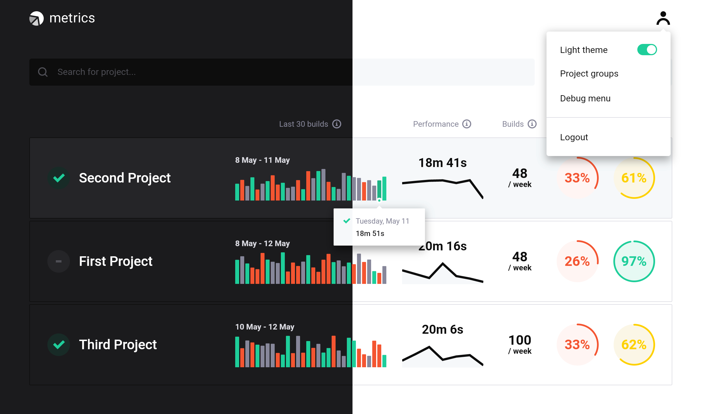

# Projects
This repository holds the source code for the following projects:
- [Metrics](#metrics-bar_chart)
- [Guardian](#guardian-shield)
- [API Mock Server](#api-mock-server-test_tube)
- [YAML Map](#yaml-map-world_map)
- [Shell Words](#shell-words-shell)

# Metrics :bar_chart:
[Metrics](metrics/readme.md) is a set of software components to collect and review software project metrics like performance, build stability, and codebase quality.
The Metrics project includes the following components:
- [Metrics Web](metrics/web) - a web application for the project metrics visualization.
- [CI Integrations](metrics/ci_integrations) - a CLI application that integrates with popular CI tools to collect software project metrics, such as Jenkins, GitHub Actions, and Buildkite.
- [Metrics CLI](metrics/cli) - a command-line tool that simplifies the deployment of Metrics components (Flutter Web application, Cloud Functions, Firestore Rules, and general setup).
- [Firebase](metrics/firebase) - defines the Firestore Security Rules and Cloud Functions needed to provide a secure and efficient serverless backend.
- [Coverage Converter](metrics/coverage_converter) - a tool that converts coverage data of specific coverage formats into [Metrics coverage format](https://github.com/platform-platform/monorepo/blob/master/metrics/ci_integrations/docs/01_ci_integration_module_architecture.md#coverage-report-format).

# Guardian :shield:
[Guardian](guardian) is a tool to detect flaky tests by analyzing JUnit XML files and orchestrate tools like Slack, Jira to notify the team.

# Api Mock Server :test_tube:
[Api Mock Server](api_mock_server) is a package that provides a mock HTTP server used for testing HTTP requests and enables full end-to-end testing of an application.

# YAML Map :world_map:
[YAML Map](yaml_map) is a wrapper around the Dart's [`yaml`](https://pub.dev/packages/yaml) package that allows parsing results straight into core Dart types.

# Shell Words :shell:
[Shell Words](shell_words) is a package that provides tools for parsing the command-line strings.

# License :scroll:
Licensed under the terms of the Apache 2.0 License that can be found in the [LICENSE file](https://github.com/platform-platform/monorepo/blob/master/LICENSE).
